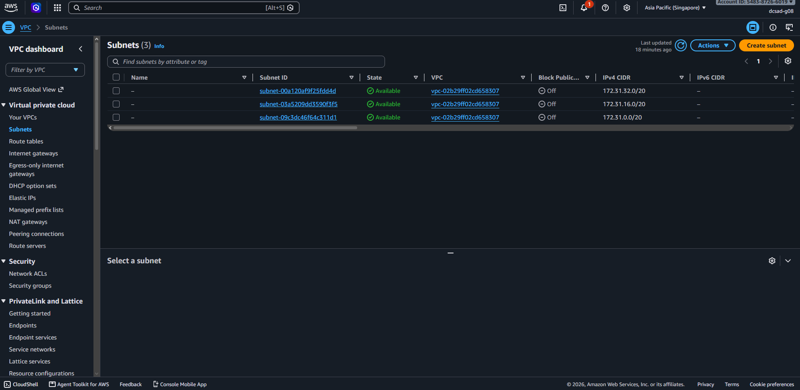
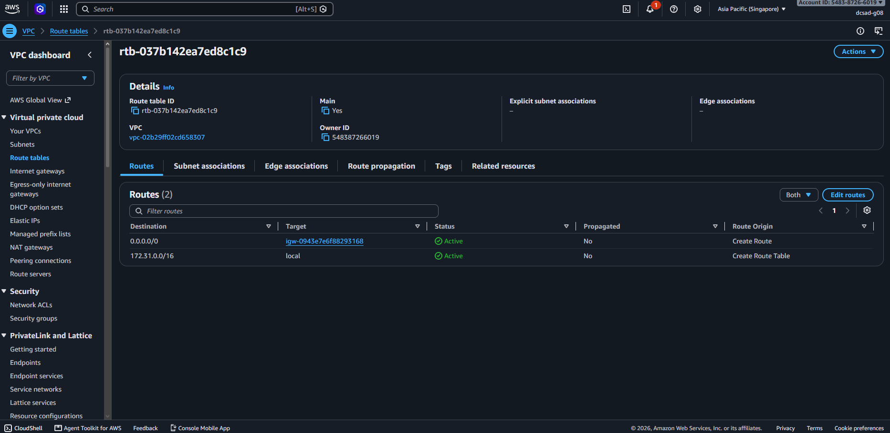
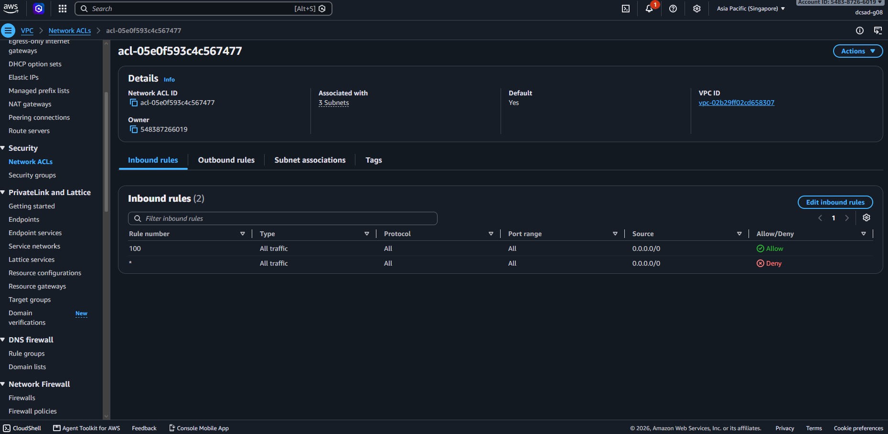
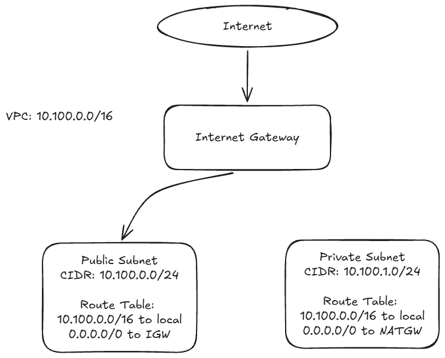

# Assignment 2 Submission

## About me

* GitHub username: micmiccc16
* Section: IV-DCSAD
* IAM user name that I signed in with: dcsad-g08
* X: 100

---

## Part A. Explore

### A1. The VPC

Default VPC IPv4 CIDR:

172.31.0.0/16

Number of addresses in that CIDR:

65,536

### A2. The subnets

| Availability Zone | IPv4 CIDR |
| --- | --- |
| apse1-az2 (ap-southeast-1a) | 172.31.32.0/20 |
| apse1-az1 (ap-southeast-1b) | 172.31.16.0/20 |
| apse1-az3 (ap-southeast-1c) | 172.31.0.0/20 |

Screenshot 1. Save it as `screenshot-1-subnets.png` in your folder. The image line below shows it.

### A3. Available addresses

Available IPv4 addresses in each subnet:

* apse1-az2 (ap-southeast-1a): 4090
* apse1-az1 (ap-southeast-1b): 4091
* apse1-az3 (ap-southeast-1c): 4091

Why is the number lower than 4,096?

Each /20 subnet has 4,096 total IPv4 addresses, but AWS reserves 5 addresses in every subnet for networking purposes (Network address, VPC router, DNS server, future use, and Network broadcast address).

What uses the missing address in the subnet with the lowest number?

The missing address in apse1-az2 (which has 4,090 available instead of 4,091) is assigned to an active Elastic Network Interface (ENI) holding a private IP address within that subnet.

### A4. The route table

| Destination | Target |
| --- | --- |
| 0.0.0.0/0 | igw-0943e7e6f88293168 |
| 172.31.0.0/16 | local |

Screenshot 2. Save it as `screenshot-2-routes.png` in your folder. The image line below shows it.

### A5. Public or private

Are the default subnets public or private? Which route proves it?

The default subnets are public. The route with destination `0.0.0.0/0` pointing to the Internet Gateway target (`igw-0943e7e6f88293168`) proves it.

### A6. The internet gateway

State of the internet gateway:

Attached

What happens to the default subnets if the gateway is detached?

If the Internet Gateway is detached from the VPC, the subnets lose their route to the public internet, preventing external clients from reaching instances and stopping instances from making outbound internet requests.

### A7. NAT gateways

Number of NAT gateways:

0

Can a server in a new private subnet download updates? Why?

No. A server in a private subnet does not have a direct route to an Internet Gateway. Without a NAT Gateway (and a route pointing to it), outbound connections to download updates cannot be established.

### A8. The network ACL

| Rule number | Source | Allow or Deny |
| --- | --- | --- |
| 100 | 0.0.0.0/0 | Allow |
| * | 0.0.0.0/0 | Deny |

How is a network ACL different from a security group?

A Network ACL operates at the subnet level and is stateless (inbound and outbound rules must be explicitly configured). A Security Group operates at the instance/resource level and is stateful (return traffic for an allowed connection is automatically permitted).

Screenshot 3. Save it as `screenshot-3-network-acl.png` in your folder. The image line below shows it.

### A9. The default security group

Inbound rule (type and source):

Type: All traffic, Source: sg-0c5b6d4081cf0a534 (the default security group itself)

Which resources can send traffic to an instance that uses it?

Only other AWS resources (such as EC2 instances) that are explicitly associated with this same default security group can send inbound traffic to it.

---

## Part B. Prepare

### B1. Plan two subnets

- Public subnet CIDR: 10.100.0.0/24
- Private subnet CIDR: 10.100.1.0/24

### B2. Route tables

Route table of the public subnet:

| Destination | Target |
| --- | --- |
| 10.100.0.0/16 | local |
| 0.0.0.0/0 | internet gateway |

Route table of the private subnet:

| Destination | Target |
| --- | --- |
| 10.100.0.0/16 | local |
| 0.0.0.0/0 | NAT Gateway |

### B3. My VPC diagram

Tool used (Excalidraw, draw.io, Lucidchart, or paper):

Excalidraw

Save your diagram as `vpc-diagram.png` in your folder. The image line below shows it.

### B4. Predict a change

Can you still open the web page from your laptop? Why?

No. Deleting the `0.0.0.0/0` route to the Internet Gateway removes the default route, so traffic from external internet clients on your laptop can no longer reach the instance.

Can the instance still reach another instance in the VPC? Why?

Yes. The `10.100.0.0/16 -> local` route remains intact in the route table, allowing local traffic between resources inside the VPC to continue working.

### B5. Place a database

Which subnet gets the database? Why?

The database should be placed in the private subnet. Databases do not need direct access from the public internet, and placing it in a private subnet provides defense-in-depth while still allowing application servers in the public subnet to reach it over the local VPC route.

### B6. My question about VPCs

What is your question, and what made you think of it?

Question: How does AWS handle IP address exhaustion inside a subnet if auto-scaling attempts to launch more instances than available IP addresses?
Why I thought of it: Looking at the available IPv4 address counts in Part A made me wonder what errors or failures occur when an expanding subnet runs completely out of usable addresses.
